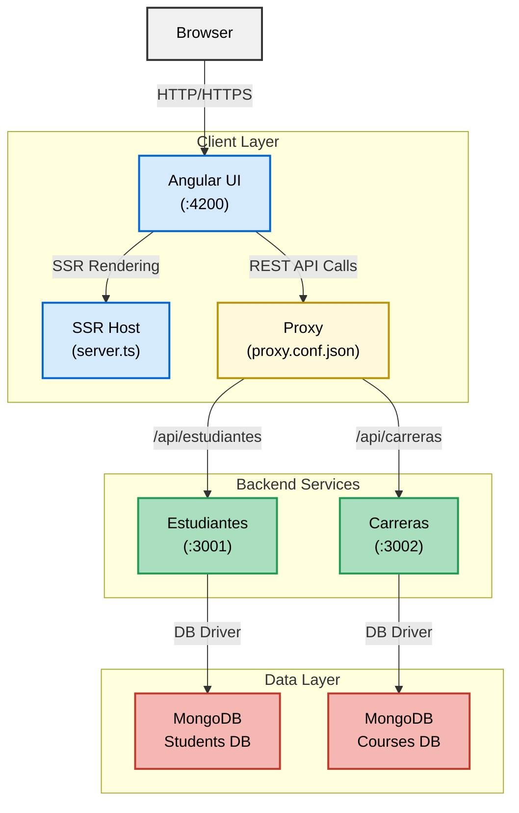

# Monorepo: Frontend Angular + Microservicios Node.js

## Estructura
- `frontend-angular`: Aplicación Angular standalone para gestión de estudiantes y carreras.
- `estudiantes-service`: Microservicio Node.js/Express para estudiantes (CRUD, CORS).
- `carreras-service`: Microservicio Node.js/Express para carreras (CRUD, CORS).

## Instrucciones rápidas

### 1. Microservicios
- Entra a cada carpeta (`estudiantes-service` y `carreras-service`)
- Ejecuta: `npm install` y luego `node index.js`

### 2. Frontend
- Entra a `frontend-angular`
- Ejecuta: `npm install` y luego `ng serve`

---

Cada microservicio expone endpoints REST y el frontend consume ambos para mostrar, crear, editar y eliminar estudiantes y carreras.

## Arquitectura del Sistema
El siguiente diagrama muestra la arquitectura del sistema de registro de estudiantes, ilustrando la interacción entre el navegador, la capa cliente, los servicios backend y la capa de datos.

---
## Descripción Detallada
El sistema de registro de estudiantes está compuesto por las siguientes capas:
- **Capa Cliente**: Incluye la interfaz de usuario en Angular, que se ejecuta en el puerto 4200 y utiliza SSR para renderizado del lado del servidor.
- **Capa de Servicios Backend**: Compuesta por microservicios para estudiantes (puerto 3001) y carreras (puerto 3002), que manejan la lógica de negocio.
- **Capa de Datos**: Bases de datos MongoDB para almacenar información de estudiantes y carreras.

