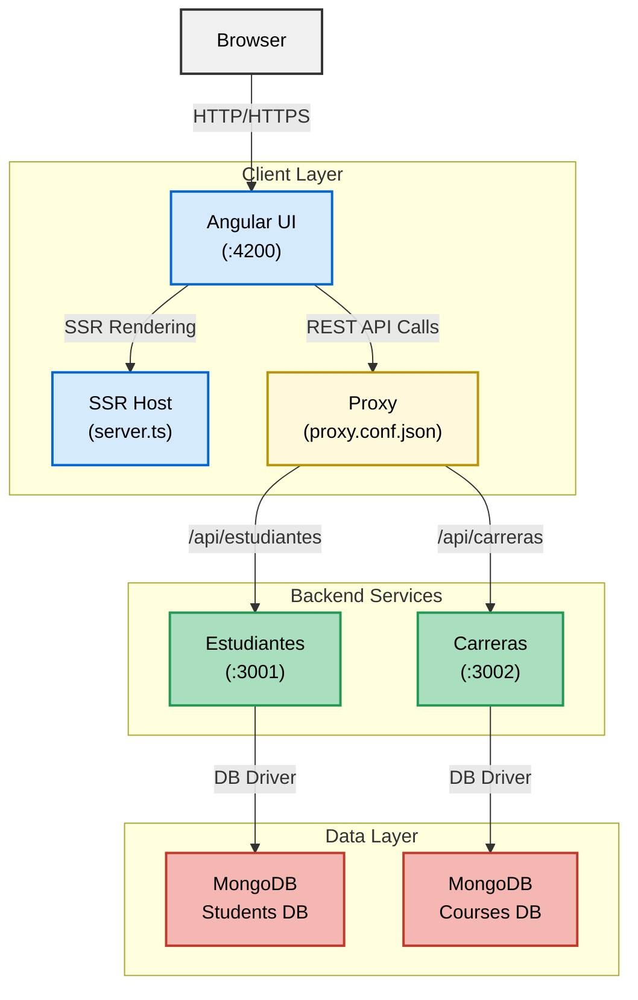

# Sistema de Gestión de Estudiantes

## Descripción General

Este proyecto implementa un sistema completo de gestión de estudiantes y carreras utilizando una arquitectura de microservicios. La solución está compuesta por un frontend desarrollado en Angular y dos microservicios backend construidos con Node.js y Express.

## Arquitectura del Sistema

### Componentes Principales

- **Frontend Angular**: Aplicación web standalone para la gestión de estudiantes y carreras
- **Microservicio de Estudiantes**: API REST para operaciones CRUD de estudiantes
- **Microservicio de Carreras**: API REST para operaciones CRUD de carreras

<h1 align="center">Tecnologías Utilizadas</h1>

<!--tech stack icons-->
<p align="center">
  <a href="https://skillicons.dev">
    
  </a>
</p>

## Instalación y Configuración

### Requisitos Previos

- Node.js (versión 16 o superior)
- npm (versión 8 o superior)
- Angular CLI (`npm install -g @angular/cli`)
- MongoDB (local o conexión remota)

### Clonar el Repositorio

```bash
git clone https://github.com/NayelyMosquera/Registro-de-Estudiantes.git
cd Registro-de-Estudiantes
```

### Configuración de Microservicios

1. **Microservicio de Estudiantes**
   ```bash
   cd estudiantes-service
   npm install
   node index.js
   ```
   El servicio se ejecutará en el puerto 3001.

2. **Microservicio de Carreras**
   ```bash
   cd carreras-service
   npm install
   node index.js
   ```
   El servicio se ejecutará en el puerto 3002.

### Configuración del Frontend

1. **Aplicación Angular**
   ```bash
   cd frontend-angular
   npm install
   ng serve
   ```
   La aplicación estará disponible en `http://localhost:4200`.

---

Cada microservicio expone endpoints REST y el frontend consume ambos para mostrar, crear, editar y eliminar estudiantes y carreras.

## Arquitectura del Sistema
El siguiente diagrama muestra la arquitectura del sistema de registro de estudiantes, ilustrando la interacción entre el navegador, la capa cliente, los servicios backend y la capa de datos.




---

## Funcionalidades

### Gestión de Estudiantes
- Crear nuevo estudiante
- Listar todos los estudiantes
- Actualizar información de estudiante
- Eliminar estudiante

### Gestión de Carreras
- Crear nueva carrera
- Listar todas las carreras
- Actualizar información de carrera
- Eliminar carrera

## API Endpoints

### Estudiantes Service (Puerto 3001)
- `GET /api/estudiantes` - Obtener todos los estudiantes
- `POST /api/estudiantes` - Crear nuevo estudiante
- `PUT /api/estudiantes/:id` - Actualizar estudiante
- `DELETE /api/estudiantes/:id` - Eliminar estudiante

### Carreras Service (Puerto 3002)
- `GET /api/carreras` - Obtener todas las carreras
- `POST /api/carreras` - Crear nueva carrera
- `PUT /api/carreras/:id` - Actualizar carrera
- `DELETE /api/carreras/:id` - Eliminar carrera

